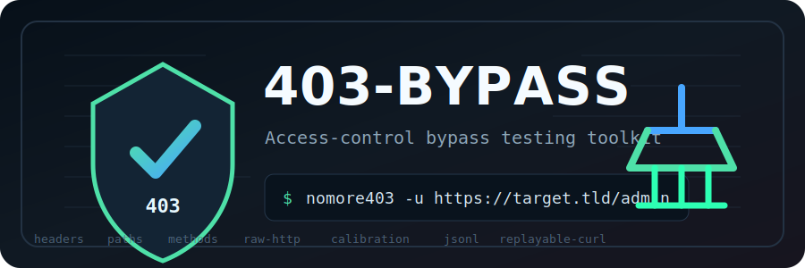

<p align="center">
  
</p>

<h1 align="center">403-bypass</h1>

<p align="center"><strong>Developed by JOJIN JOHN</strong></p>

<p align="center">
  <a href="https://github.com/jojin1709/403-bypass/stargazers"></a>
  <a href="https://github.com/jojin1709/403-bypass/forks"></a>
  
  
  
</p>

`403-bypass` is a command-line tool for testing HTTP access-control bypasses and parser inconsistencies around `401`, `403`, and related responses.

The tool is designed for practical web security work: bug bounty, penetration testing, security reviews, and regression testing of access-control rules. It automates a broad set of request mutations, captures a baseline, filters common false positives, and highlights the responses most likely to represent a meaningful bypass.

## What It Does

Given a target URL, `nomore403`:

1. Sends a baseline request to capture the blocked response.
2. Optionally auto-calibrates against non-existent paths to learn the target's default error behavior.
3. Runs a set of bypass techniques that mutate the request path, method, headers, or wire format.
4. Scores and groups the results to reduce noise.
5. Emits replayable evidence, including `curl` commands for interesting findings.

This tool does not "break authentication" by itself. It helps find differences between how frontends, proxies, WAFs, CDNs, application routers, and backends interpret the same request.

## Features

- Baseline-driven comparison against the blocked response
- Auto-calibration to reduce false positives from default `404` or parent-path responses
- Scored output with separate summaries for likely bypasses and interesting variations
- False-positive filtering using status, length, body hash, HTML title, body class, and WAF/block-page detection
- Replay and reproducibility for high-value findings
- Retry and backoff for transient network failures
- Concurrent execution with per-technique progress
- Raw HTTP support for request forms that `net/http` normalizes away
- JSON and JSONL output for pipelines and post-processing
- Input from a single URL, URL files, stdin, or request files

## Installation

### Build from source

```bash
git clone https://github.com/jojin1709/403-bypass.git
cd 403-bypass
go build -o nomore403
```

### Build on Windows PowerShell

```powershell
git clone https://github.com/jojin1709/403-bypass.git
cd 403-bypass
go build -o nomore403.exe
.\nomore403.exe --help
```

If Go cannot write to the default cache folder on Windows, use local cache folders before testing or building:

```powershell
$env:GOCACHE="$PWD\.gocache"
$env:GOPATH="$PWD\.gopath"
go test ./...
go build -o nomore403.exe
```

The `payloads/` directory is read at runtime. Keep it beside the executable, or point the tool to it with `-f`.

## Requirements

- Go 1.24 or later to build from source
- `curl` available in `PATH` for techniques that depend on it, such as:
  - `http-versions`
  - `http-parser`
  - `absolute-uri`

Most techniques work without `curl`.

## Quick Start

Basic scan:

```bash
./nomore403 -u https://target.tld/admin
```

Use a proxy and verbose output:

```bash
./nomore403 -u https://target.tld/admin -x http://127.0.0.1:8080 -v
```

Run only selected techniques:

```bash
./nomore403 -u https://target.tld/admin -k headers,absolute-uri,raw-desync
```

Read targets from stdin:

```bash
cat urls.txt | ./nomore403
```

Use a Burp-style request file:

```bash
./nomore403 --request-file request.txt
```

Write machine-readable output:

```bash
./nomore403 -u https://target.tld/admin --jsonl -o findings.jsonl
```

### Windows PowerShell examples

Run the executable from the current folder:

```powershell
.\nomore403.exe --help
```

Run a low-noise scan:

```powershell
.\nomore403.exe -u https://target.tld/admin -k headers,endpaths,midpaths --top 10
```

Run slower against WAF-protected authorized targets:

```powershell
.\nomore403.exe -u https://target.tld/admin -k headers,endpaths --max-goroutines 2 --delay 1000 --top 10
```

Save JSONL output:

```powershell
.\nomore403.exe -u https://target.tld/admin --jsonl -o findings.jsonl
```

Use a Burp-style raw request file:

```powershell
.\nomore403.exe --request-file .\request.txt --jsonl -o findings.jsonl
```

## Example Output

```text
target: https://target.tld/admin   method: GET   frontend: AWS ELB/ALB   payloads: payloads

calib: 404 | 1245b | +/-50 | frag 703b

BASELINE
  default       403    520 bytes    https://target.tld/admin

FINDINGS
  hdr-ip     100! 200   2048 bytes   X-Original-URL: /
  abs-uri     26. 403    236 bytes   request-target: https://target.tld/admin
  http        18. 400    122 bytes   HTTP/2

no visible results: 17 techniques

============== LIKELY BYPASS ==============
[!100 HIGH] Header injection (IP) 403=>200    2048b
         why: status 403->200, len delta 1528, body changed, type changed
        item: X-Original-URL: /
        curl: curl -i -sS -k -H 'User-Agent: nomore403' -H 'X-Original-URL: /' 'https://target.tld/admin'
```

## How to Read the Output

### Main technique output

Each visible line is a response that differed enough from the baseline to survive filtering.

Typical fields:

- technique alias, for example `hdr-ip`, `abs-uri`, or `parser`
- compact score marker such as `18.`, `61+`, or `100!`
- final response status
- response size
- item or payload used

### Summary transitions

The final summaries show baseline-to-result transitions:

- `403=>200` usually deserves immediate attention
- `403=>302` can be interesting, but may still resolve back into an auth barrier
- `403->400` or `403->404` usually indicate parser or routing differences rather than a bypass

### Summaries

At the end of the run, `nomore403` prints:

- `LIKELY BYPASS`
  - highest-scoring results
  - includes reproducible `curl`
- `INTERESTING VARIATIONS`
  - meaningful parser or routing differences that are worth manual review
- `no visible results`
  - count of techniques that ran but produced no visible output after filtering

## Scoring Model

Scoring is heuristic. It is intended to prioritize results, not to prove exploitation.

The tool generally rewards:

- transitions to `2xx`
- transitions to `3xx`
- large body-length changes
- body hash changes
- HTML title changes
- body-class changes, such as `waf-block` to `html` or `login` to `json`
- `Location` changes
- anomalous redirects that do not appear to resolve into a login or denied flow
- differences that survive replay

The tool generally down-ranks:

- near-identical responses
- `200` responses that have the same body hash as the blocked baseline
- responses with the same HTML title and same body class as the blocked baseline
- Cloudflare, WAF, or generic block pages
- repeated parser noise
- unstable replay results
- empty-body redirects that appear to lead back into access control
- many `400` and `404` cases unless the response also changes substantially

Recommended interpretation:

- `HIGH`: likely actionable; review first
- `MED`: plausible candidate; usually worth manual replay
- `LOW`: parser difference, routing anomaly, or lower-confidence behavior

### False-positive filtering

Many sites return `200` for a rewritten or fragment-stripped URL while still serving the same error, homepage, login page, or WAF block page. The tool now fingerprints responses with:

- body hash
- HTML `<title>`
- body class, for example `waf-block`, `login`, `access-denied`, `not-found`, `json`, or `html`
- WAF/block-page signals from body text and headers such as `CF-Ray`

This means a result like `403->200` is no longer treated as strong by status alone. If it has the same body, same title, or the same WAF/block page as the baseline, it is pushed down into low-confidence output.

In JSON and JSONL output, check these fields:

```json
{
  "status_code": 200,
  "score": 18,
  "likelihood": "low",
  "score_reason": "status 403->200, same body as baseline, same body class",
  "body_hash": "9f31...",
  "title": "Oooops! WAF has blocked the action.",
  "body_class": "waf-block",
  "waf_block": true
}
```

Treat `waf_block: true`, `same body as baseline`, or `same body class` as signs that the result probably needs manual review before calling it a bypass.

## Auto-Calibration

Auto-calibration is enabled by default in non-verbose mode.

It sends requests to several non-existent paths and builds a baseline for the target's default error behavior. It also performs a fragment-based calibration request to reduce false positives caused by fragment-stripped paths.

Use these flags to control it:

- `--no-calibrate`
  - compare only against the default blocked response
- `--strict-calibrate`
  - also compare body hash and key headers such as `Location`, `Content-Type`, and `Server`

## Techniques

The tool runs all techniques by default unless you specify `-k`.

### Method and verb mutations

- `verbs`
  - alternative HTTP methods from `payloads/httpmethods`
- `verbs-case`
  - randomized casing of HTTP methods
- `method-override`
  - query, header, and body-based method override patterns

### Header- and trust-based mutations

- `headers`
  - umbrella technique covering:
    - IP trust headers
    - simple headers
    - Host variations
- `hop-by-hop`
  - hop-by-hop stripping tricks using `Connection`
- `header-confusion`
  - rewrite and path-override headers such as `X-Original-URL`
- `host-override`
  - host override and forwarded-host variants
- `forwarded-trust`
  - `Forwarded`, `Client-IP`, `Cluster-Client-IP`, and related trust chains
- `proto-confusion`
  - `X-Forwarded-Proto`, `X-Forwarded-Port`, and related scheme hints
- `ip-encoding`
  - localhost and trusted-address variants in dotted, integer, hex, and IPv6 forms

### Path and normalization mutations

- `endpaths`
  - suffix and end-of-path mutations from `payloads/endpaths`
- `midpaths`
  - path insertion and traversal-style mutations from `payloads/midpaths`
- `double-encoding`
  - encoded path variants, including aggressive double-encoding forms
- `unicode`
  - `%uXXXX` and overlong UTF-8 path variants
- `path-case`
  - path segment case switching
- `path-normalization`
  - dot-segment and semicolon normalization variants
- `suffix-tricks`
  - suffix and extension tricks such as `.json`, `.css`, `;index.html`, and format-style query toggles
- `payload-position`
  - inserts payloads at explicitly marked positions in the URL

### Frontend and wire-format mutations

- `http-versions`
  - compares the same request across `HTTP/1.0` and `HTTP/2`
- `http-parser`
  - sends a deliberately minimal `curl` request to expose client/frontend parser differences separately from `http-versions`
- `absolute-uri`
  - uses absolute-form request targets through `curl --request-target`
- `raw-duplicates`
  - duplicate security-relevant headers with raw HTTP
- `raw-authority`
  - duplicate or conflicting authority and host signals
- `raw-desync`
  - request forms aimed at frontend/backend parsing differences, including conflicting transfer semantics

## Raw HTTP Behavior

Some techniques need wire-level control that Go's `net/http` client does not provide. Those techniques use the raw HTTP engine.

Raw techniques currently include:

- `raw-duplicates`
- `raw-authority`
- `raw-desync`
- some `%uXXXX` unicode path requests

Notes:

- raw requests are sent automatically where needed
- raw techniques do not currently support upstream proxies
- raw behavior is useful for:
  - duplicate headers
  - exact request targets
  - transfer-encoding and content-length edge cases

## Fingerprinting and Technique Order

The tool may infer frontend hints such as:

- AWS ELB / ALB
- CloudFront
- Cloudflare
- Nginx
- Envoy
- Apache
- IIS

These hints are used to improve technique ordering and output context.

Important:

- fingerprinting does not disable techniques by default
- unless you use `-k`, the tool still runs the full default technique set

## Reproducibility and Replay

High-value results are replayed automatically in the final summary.

The replay output helps answer:

- did the behavior repeat?
- did it keep the same status and response shape?
- is this likely stable enough to investigate or report?

The final summary includes:

- replay counts such as `1/1` or `2/2 matched on replay`
- a replayable `curl` command for interesting results

## Input Modes

### Single target

```bash
./nomore403 -u https://target.tld/admin
```

### File containing URLs

```bash
./nomore403 -u targets.txt
```

### Stdin

```bash
cat targets.txt | ./nomore403
```

### Request file

```bash
./nomore403 --request-file request.txt
```

Request files are useful when replaying traffic captured in Burp or another proxy.

## Custom Payload Positions

Use `--payload-position` when you want to inject payloads at explicit markers instead of relying only on built-in endpath and midpath mutation logic.

Example:

```bash
./nomore403 -u 'https://target.tld/§100§/admin/§200§' -p §
```

## Common Workflows

### Fast triage

```bash
./nomore403 -u https://target.tld/admin
```

### Investigate with an intercepting proxy

```bash
./nomore403 -u https://target.tld/admin -x http://127.0.0.1:8080 -v
```

### Run only raw and frontend-focused techniques

```bash
./nomore403 -u https://target.tld/admin -k absolute-uri,raw-duplicates,raw-authority,raw-desync
```

### Test a custom trusted IP

```bash
./nomore403 -u https://target.tld/admin -i 10.0.0.5
```

### Save JSONL for later analysis

```bash
./nomore403 -u https://target.tld/admin --jsonl -o findings.jsonl
```

### Windows PowerShell with JSON output

```powershell
.\nomore403.exe -u https://target.tld/admin --json -o findings.json
```

### Linux/macOS request-file mode

```bash
./nomore403 --request-file request.txt -k headers,endpaths --jsonl -o findings.jsonl
```

### Windows request-file mode

```powershell
.\nomore403.exe --request-file .\request.txt -k headers,endpaths --jsonl -o findings.jsonl
```

### Build and test locally

Linux/macOS:

```bash
go test ./...
go build -o nomore403
```

Windows PowerShell:

```powershell
$env:GOCACHE="$PWD\.gocache"
$env:GOPATH="$PWD\.gopath"
go test ./...
go build -o nomore403.exe
```

## GitHub Actions

The repository includes:

- `.github/workflows/test.yml`
  - runs `go test ./...`
  - runs `go build ./...`
  - triggers on pushes to `main` and pull requests
- `.github/workflows/release.yml`
  - builds Windows `.exe`
  - builds Linux amd64
  - builds macOS amd64 and arm64
  - packages the `payloads/` folder with each binary
  - publishes artifacts automatically when you push a version tag

Create a release from your terminal:

```bash
git tag v0.1.0
git push origin v0.1.0
```

On Windows PowerShell:

```powershell
git tag v0.1.0
git push origin v0.1.0
```

## Flags

Run `./nomore403 --help` for the full up-to-date CLI.

Key flags:

- `-u, --uri`
  - target URL, file of URLs, or input path
- `-k, --technique`
  - comma-separated list of techniques to run
- `-x, --proxy`
  - upstream proxy
- `-H, --header`
  - add custom headers
- `-i, --bypass-ip`
  - IP or hostname used in trust-header techniques
- `-v, --verbose`
  - show all visible results, not just filtered output
- `--json`
  - write structured JSON
- `--jsonl`
  - write one JSON object per result
- `--no-calibrate`
  - disable auto-calibration
- `--strict-calibrate`
  - compare more response fields during filtering
- `--retry-count`
  - number of retries for transient errors
- `--retry-backoff-ms`
  - exponential backoff base in milliseconds
- `--host-delay`
  - delay between batched targets on the same host
- `--top-score-min`
  - minimum score for `LIKELY BYPASS`
- `--variation-score-min`
  - minimum score for `INTERESTING VARIATIONS`
- `--top`
  - maximum number of entries per summary section, or `0` to disable summaries

## Output Formats

### Human-readable terminal output

Default mode is optimized for interactive review and triage.

### JSON

Use `--json` for a single structured document.

### JSON Lines

Use `--jsonl` when you want to:

- process results incrementally
- store evidence in pipelines
- import findings into your own tooling

## Payload Files

The `payloads/` directory contains lists used by several techniques.

Current files include:

- `httpmethods`
- `headers`
- `ips`
- `simpleheaders`
- `endpaths`
- `midpaths`
- `useragents`

You can customize these files to fit your targets or workflow.

## Limitations

- raw HTTP techniques do not currently support upstream proxies
- scoring is heuristic and can produce false positives or false negatives
- redirect scoring currently uses heuristics on the immediate redirect response, not a fully followed redirect chain
- some techniques depend on target-specific behavior and may appear noisy on heavily normalized stacks
- `curl`-based techniques require `curl` in `PATH`

## Security and Responsible Use

Use this tool only on systems you are authorized to test.

The authors and contributors are not responsible for misuse. You are responsible for complying with applicable law, program rules, and organizational policy.

## Contributing

Contributions are welcome.

Useful contribution areas include:

- bug fixes
- better payloads
- new bypass techniques
- raw HTTP improvements
- frontend fingerprinting
- documentation and examples

Before contributing a technique, prefer:

- a clearly distinct parsing or trust-boundary behavior
- reproducible evidence
- tests that verify the request shape or replay behavior

## License

This project is released under the MIT License. See [LICENSE](LICENSE).
